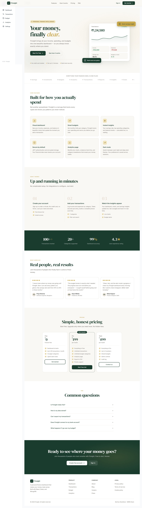
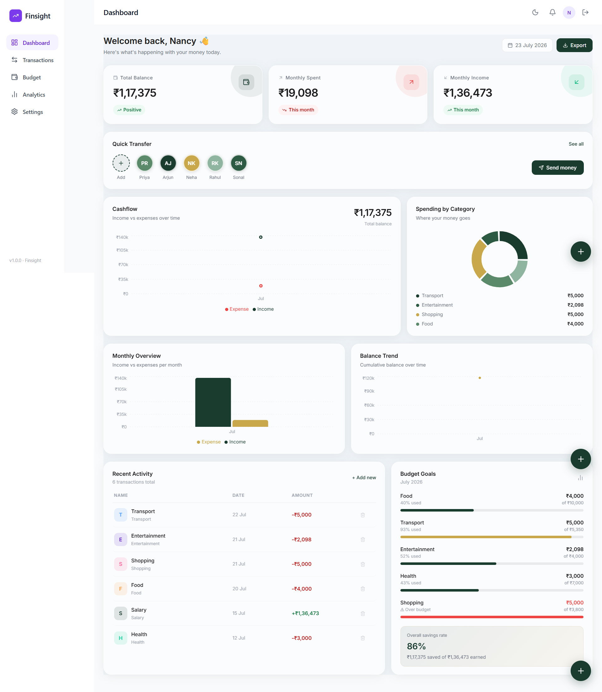
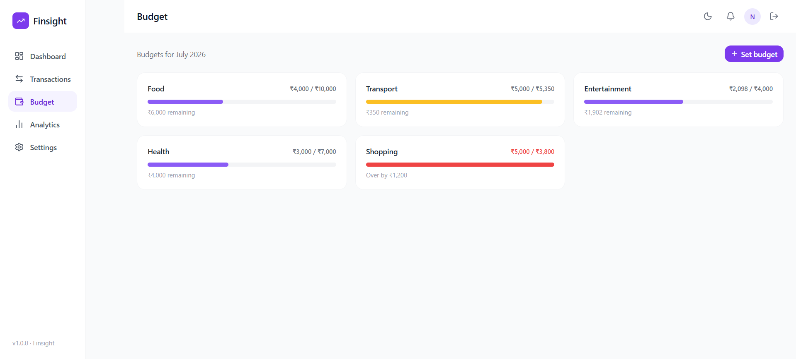
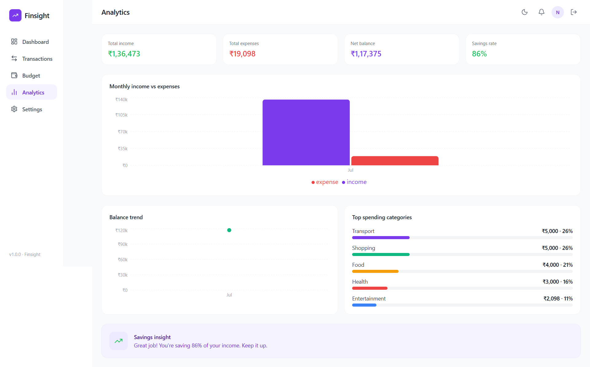

# Finsight — Personal Finance Dashboard

A full-stack personal finance app built with the MERN stack. Track income and expenses, set monthly budgets, and visualise your spending — all in one clean dashboard.

---
## Screenshots

<p align="center">
  
  
</p>

<p align="center">
  
  
</p>


---

## Features

- **Dashboard** — balance overview, 4 live charts (cashflow, pie, bar, trend), recent activity table, budget goals
- **Transactions** — add, filter by type, search by name or category, delete
- **Budget tracker** — set monthly limits per category, animated progress bars, over-budget alerts
- **Analytics** — bar chart, line chart, top spending categories, savings rate insight
- **Landing page** — public marketing page with live mini-dashboard in the hero
- **Auth** — JWT-based login and register, protected routes, session persistence
- **Dark mode** — full theme toggle, preference saved to localStorage
- **Responsive** — mobile sidebar drawer, works on all screen sizes

---

## Tech Stack

| Layer | Tech |
|---|---|
| Frontend | React, Tailwind CSS, React Router v6 |
| Charts | Recharts |
| Animation | Framer Motion |
| State | Zustand |
| Backend | Node.js, Express |
| Database | MongoDB Atlas, Mongoose |
| Auth | JWT, bcryptjs |

---

## Getting Started

**Clone the repo**
```bash
git clone https://github.com/yourusername/finsight.git
cd finsight
```

**Backend**
```bash
cd server
npm install
```

Create `server/.env`:
```
MONGO_URI=your_mongodb_atlas_uri
JWT_SECRET=your_secret_key
PORT=5000
```

```bash
npm run dev
```

**Frontend**
```bash
cd client
npm install
npm run dev
```

App runs at `http://localhost:5173`

---

## Project Structure

```
finsight/
├── client/                 # React frontend
│   └── src/
│       ├── pages/          # Dashboard, Transactions, Budget, Analytics, Landing
│       ├── components/     # Sidebar, Topbar, StatCard, TransactionRow, Modals
│       ├── store/          # Zustand finance store
│       ├── context/        # AuthContext, ThemeContext
│       └── api/            # Axios instance
└── server/                 # Express backend
    ├── models/             # User, Transaction, Budget
    ├── routes/             # auth, transactions, budgets
    └── middleware/         # JWT auth middleware
```

---

## Live Demo

| | |
|---|---|
| Frontend | [finsight.vercel.app](https://finsight.vercel.app) |
| Backend | [finsight-api.onrender.com](https://finsight-api.onrender.com) |

---

## Author

Built by **Shambhavi** · [GitHub](https://github.com/yourusername) · [LinkedIn](https://linkedin.com/in/yourusername)

